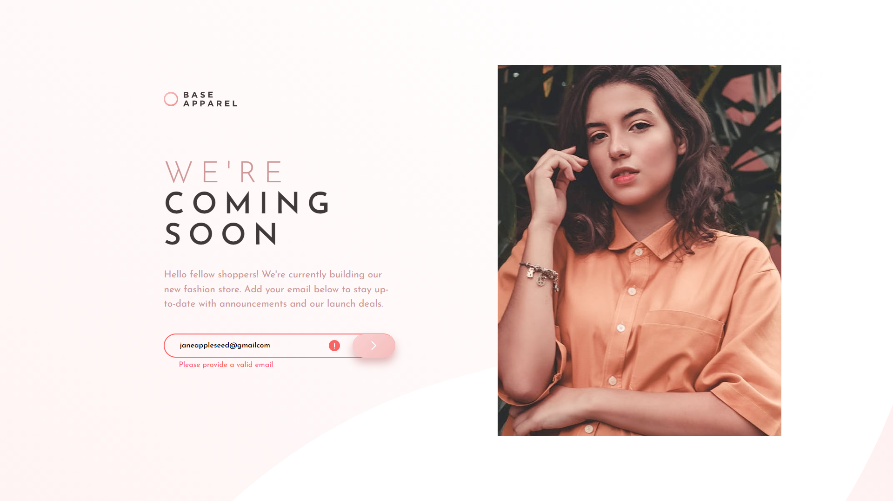

# Frontend Mentor - Base Apparel coming soon page solution

This is a solution to the [Base Apparel coming soon page challenge on Frontend Mentor](https://www.frontendmentor.io/challenges/base-apparel-coming-soon-page-5d46b47f8db8a7063f9331a0). 

## Table of contents

- [Overview](#overview)
  - [The challenge](#the-challenge)
  - [Screenshot](#screenshot)
  - [Links](#links)
- [My process](#my-process)
  - [Built with](#built-with)
  - [What I learned](#what-i-learned)
  - [Continued development](#continued-development)
  - [Useful resources](#useful-resources)

## Overview

### The challenge

Your task is to build out the project to the designs inside the `/design` folder. You will find both a mobile and a desktop version of the design. 

The designs are in JPG static format. Using JPGs will mean that you'll need to use your best judgment for styles such as `font-size`, `padding` and `margin`. 

Users should be able to:

- View the optimal layout for the site depending on their device's screen size
- See hover states for all interactive elements on the page
- Receive an error message when the `form` is submitted if:
  - The `input` field is empty
  - The email address is not formatted correctly

### Screenshot

I've included 5 screenshots in the `/screenshots` folder: fullscreen, desktop, mobile, tablet top half, and tablet bottom half.

### Links

- [Solution URL](https://www.frontendmentor.io/solutions/mobilefirst-using-bem-flexbox-css-grid-and-vanilla-js-8DLgJ5Vm1)
- [Live Site URL](https://victor-nyagudi.github.io/base-apparel-coming-soon-page/)

## My process

I started with the HTML while observing the desktop version, but this particular challenge differed
from the others in that the order of which certain parts of the website appeared varied from mobile to desktop.

This required me to refer to the mobile version as well. Once I wrote the HTML, I did the CSS for the
mobile version then tablet then desktop. Some more reading than usual was required for this challenge
since I used CSS grid for the first time here, and I needed to make sure I had it down. 

### Built with

- Semantic HTML5 markup
- CSS custom properties
- Flexbox
- CSS Grid
- Mobile-first workflow
- Vanilla JavaScript

### What I learned

I learned how to use an image as a submit button, how to implement CSS grid in a layout, some helpful
info on specifity, and I finally used the `<picture>` element with `<source>` to solve the art 
direction problem where you want to use two different images for different screen sizes.

I think it turned out all right. 

### Continued development

This is my first time using CSS grid and the `<picture>` element. Even though I'm glad with how things 
turned out, I'd like to practice more with them. I haven't done that many challenges yet with either
an art direction or resolution switching problem, so I'm hoping to tackle those in future.

I didn't time myself on this because I had to do some reading on grid and how to use it. I also referred
back to the article about CSS selectors a couple of times, but I'm getting better with those. 

All the articles that were helfpul are listed below. 

### Useful resources

- [CSS Grid](https://www.w3schools.com/css/css_grid.asp) - This helped me get started with grid. I really liked the clear explanations with examples to help drive the point home. I'll probably be referring to this a couple more times in the future until I'm comfortable with grid.
- [fr unit](https://css-tricks.com/introduction-fr-css-unit/) - This is a good article which helped me understand fractional units in grid. One of the challenges I had was trying to make the container grow to a 
certain width when there's space remaining. `flex-grow` does this in flexbox, so it was nice to find some sort of equivalent in CSS grid.
- [Specifity](https://developer.mozilla.org/en-US/docs/Web/CSS/Specificity) - A good article on specificity.